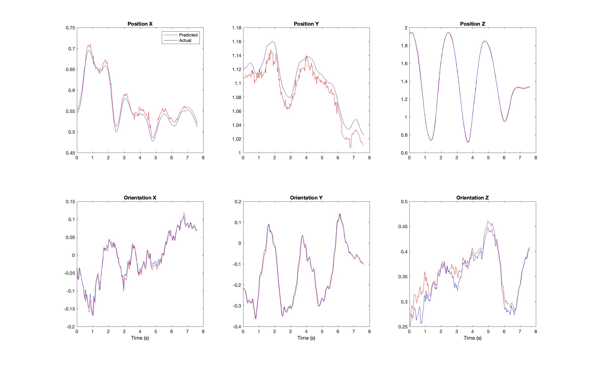
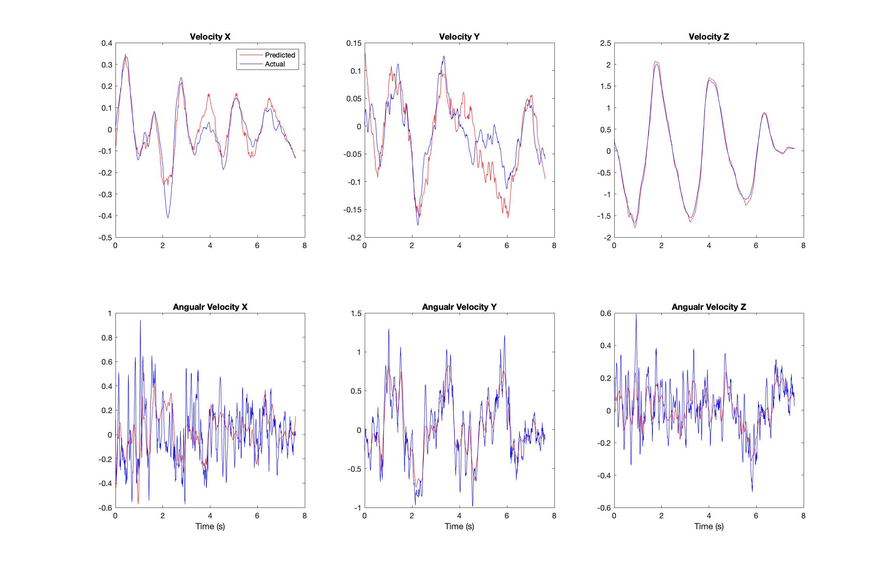

# Project-2-Visual-Odometry-RANSAC
Computed Visual Odometry using corner extraction from April Tags and optical flow using ORB

## Setup
The dataset required for this project is stored in the [data](data) directory and managed using **Git LFS**.

Clone the repository with Git LFS enabled:

```bash
git lfs install
git clone https://github.com/jagennath-hari/Project-2-Visual-Odometry-RANSAC
```

If you cloned the repo without LFS enabled, run:
```bash
git lfs pull
```

## Part 1
Computed state of quadrotor using the corner extraction from April Tags.

### Results
<p align = 'center'></p> 

## Part 2
State estimation of quadrotor using optical flow using ORB and KLT tracker, additional step of outlier removal using RANSAC.

### Results
<p align = 'center'></p> 

## Report
To read a detailed report, click [HERE](assets/Report.pdf).
